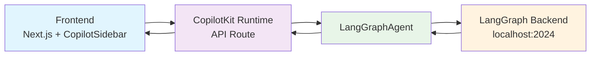

# CopilotKit + LangGraph + Next.js 集成

快速集成 CopilotKit 和 LangGraph，构建 AI 原生应用。

## 🏗️ 架构



**数据流**: `Frontend → CopilotKit Runtime → LangGraph → LangGraph Backend`

**关键组件**:
- **CopilotSidebar**: 聊天界面组件
- **CopilotKit Runtime**: 中间层，处理 API 请求
- **LangGraphAgent**: 连接 LangGraph 服务的桥梁
- **LangGraph Backend**: 你的 AI 代理服务

## 🚀 Quick Start

### 前置条件
- Node.js 18+
- pnpm
- LangGraph 服务运行在 `http://localhost:2024`

**⚠️ 重要提示**：
- LangGraph 服务默认端口是 **2024**，但如果使用 `langgraph up` 启动，端口可能不同
- Agent 名称必须与 `langgraph.json` 中的 `graphs` 字段对应
- 每个 graph ID 会自动创建一个默认 assistant

### 1. 创建项目

```bash
npx create-next-app@latest my-copilot-app
cd my-copilot-app
```

### 2. 安装依赖

```bash
pnpm add @copilotkit/react-ui @copilotkit/react-core @copilotkit/runtime openai@^4.85.1 zod@^3.23.8
```

### 3. 配置环境变量

```env
# 注意：纯 LangGraph 模式下，可以使用假 API key
OPENAI_API_KEY=sk-1234567890abcdef
LANGGRAPH_DEPLOYMENT_URL=http://localhost:2024
# ⚠️ 如果使用 langgraph up 启动，请确认实际端口并修改
# 例如：LANGGRAPH_DEPLOYMENT_URL=http://localhost:8124
```

### 4. 创建 API 路由

`app/api/copilotkit/route.ts`:

```typescript
import {
  CopilotRuntime,
  OpenAIAdapter,
  copilotRuntimeNextJSAppRouterEndpoint
} from "@copilotkit/runtime";
import { LangGraphAgent } from "@copilotkit/runtime/langgraph";
import OpenAI from "openai";
import { NextRequest } from "next/server";

const openai = new OpenAI({ apiKey: process.env.OPENAI_API_KEY });
const serviceAdapter = new OpenAIAdapter({ openai } as any);

const runtime = new CopilotRuntime({
  agents: {
    'default': new LangGraphAgent({
      deploymentUrl: process.env.LANGGRAPH_DEPLOYMENT_URL || "http://localhost:2024",
      graphId: 'agent', // ⚠️ 必须与 langgraph.json 中的 graphs 字段对应
    })
  },
});

export const POST = async (req: NextRequest) => {
  const { handleRequest } = copilotRuntimeNextJSAppRouterEndpoint({
    runtime,
    serviceAdapter,
    endpoint: "/api/copilotkit",
  });

  return handleRequest(req);
};
```

**📋 配置说明**：
- `graphId: 'agent'` 必须与你的 `langgraph.json` 中的 graph ID 完全匹配
- 例如，如果你的 `langgraph.json` 如下：
  ```json
  {
    "graphs": {
      "customer_support": "./src/agent.py:graph",
      "sales_bot": "./src/sales.py:graph"
    }
  }
  ```
  那么你应该使用对应的 graph ID（如 `"customer_support"` 或 `"sales_bot"`）

### 5. 配置布局

`app/layout.tsx`:

```tsx
import { CopilotKit } from "@copilotkit/react-core";
import "@copilotkit/react-ui/styles.css";

export default function RootLayout({
  children,
}: {
  children: React.ReactNode;
}) {
  return (
    <html lang="en">
      <body>
        <CopilotKit runtimeUrl="/api/copilotkit" showDevConsole={false}>
          {children}
        </CopilotKit>
      </body>
    </html>
  );
}
```

### 6. 添加聊天界面

`app/page.tsx`:

```tsx
"use client";

import { CopilotChat } from "@copilotkit/react-ui";

export default function Home() {
  return (
    <div className="h-screen flex flex-col">
      <header className="bg-white shadow-lg border-b-2 border-gray-200 px-10 py-4">
        <h1 className="text-lg font-semibold text-gray-800">AI Chat Assistant</h1>
      </header>
      <div className="flex-1 relative">
        <CopilotChat
          className="absolute inset-0 flex flex-col px-80"
          labels={{
            placeholder: "输入你的问题...",
          }}
        />
      </div>
    </div>
  );
}
```

### 7. 启动应用

```bash
pnpm dev
```

访问 `http://localhost:3000`，点击 "Open Chat" 开始对话！

### 8. 验证集成

```bash
# 测试 API
curl -X POST http://localhost:3000/api/copilotkit \
  -H "Content-Type: application/json" \
  -d '{"method":"info","params":{}}'
```

## 🔧 可选：本地 LangGraph 后端集成

> **💡 提示**：本章节为可选内容。如果你已经有一个运行中的 LangGraph 服务（如使用 LangGraph Studio），可以跳过此章节。

### ⚠️ 集成前的重要考虑

在决定是否采用本项目的全栈集成方案之前，请考虑你的 LangGraph agent 的复杂度：

#### ✅ 适合本集成方案的情况：
- Agent 使用常见的 Python 包（如 `langchain`、`requests`、`numpy` 等）
- 依赖包较少且都是纯 Python 包
- 不需要特殊的系统依赖或 C 扩展

#### ❌ 建议分离部署的情况：
- Agent 依赖复杂的科学计算库（如 `torch`、`tensorflow`、`scipy`）
- 需要特定版本的 CUDA 或其他 GPU 支持
- 依赖包含 C 扩展的包（如某些数据库驱动）
- 需要 Linux 特定的系统库
- Python 版本有特殊要求

#### 🔄 推荐的分离方案：
如果你的 agent 属于复杂情况，建议：
1. **前端**：使用本项目的 Quick Start 部分，只启动 Next.js 应用
2. **后端**：单独在 Python 环境中运行 `langgraph dev` 或 `docker-compose`
3. **连接**：通过 `LANGGRAPH_DEPLOYMENT_URL` 环境变量连接两者

---

如果你想在本项目中集成一个简单的 LangGraph 后端，可以按照以下步骤操作：

### 前置条件
- Python 3.8+
- Node.js 18+
- pnpm

### 1. 安装 concurrently

```bash
pnpm add -D concurrently
```

### 2. 创建 agent 目录和文件

创建 `agent/` 目录，并添加以下文件：

**agent/langgraph.json**:
```json
{
  "dependencies": ["."],
  "graphs": {
    "agent": "./agent.py:agent"
  },
  "env": "../.env"
}
```

**agent/agent.py**:
```python
from langchain.chat_models import init_chat_model
from langchain.agents import create_agent
from langchain.tools import tool
from dotenv import load_dotenv
import os

load_dotenv('../.env')

@tool
def get_weather(city: str) -> str:
    """Get the current weather for a given city."""
    # Placeholder implementation
    return f"The current weather in {city} is sunny with a temperature of 25°C."

agent = create_agent(
    model=init_chat_model("openai:"+os.getenv("MODEL_NAME",'gpt-3.5-turbo')),
    tools=[get_weather],
    system_prompt="You are a helpful weather assistant."
)

if __name__ == "__main__":
    state = agent.invoke({"messages":"Tell me the weather in New York City."})
    state["messages"][-1].pretty_print()
```

**⚠️ 重要说明**：
- `langgraph.json` 中的 graph ID 必须是 `"agent"`，因为前端的 `route.ts` 中硬编码了 `graphId: 'agent'`
- 如果你修改了 graph ID，必须同时修改 `app/api/copilotkit/route.ts` 中的对应配置

**环境变量说明**：
- 所有环境变量现在统一在根目录 `.env` 文件中管理
- LangGraph 通过 `langgraph.json` 中的 `"env": "../.env"` 配置直接读取根目录环境变量
- 不再需要 `agent/.env` 文件，避免了敏感信息分散管理

**agent/requirements.txt**:
```txt
langchain
python-dotenv
langgraph
```

### 3. 修改 package.json 脚本

将原有的 `dev` 命令：

```json
"dev": "next dev"
```

修改为：

```json
"dev": "concurrently --names \"UI,Agent\" --prefix-colors \"blue,cyan\" \"pnpm run dev:next\" \"pnpm run dev:langgraph\"",
"dev:next": "next dev",
"dev:langgraph": "cd agent && npx @langchain/langgraph-cli dev --port 2024 --no-browser"
```

### 4. 配置环境变量

在根目录的 `.env` 文件中配置：

```env
# AI 模型配置（必需）
OPENAI_BASE_URL=https://apis.iflow.cn/v1/
OPENAI_API_KEY=your-openai-api-key
MODEL_NAME=kimi-k2

# LangGraph 服务配置（可选）
LANGGRAPH_DEPLOYMENT_URL=http://localhost:2024
```

**说明**：
- 所有环境变量统一在根目录 `.env` 文件中管理
- `MODEL_NAME` 用于指定使用的 AI 模型，示例中为 `kimi-k2`
- LangGraph 通过 `langgraph.json` 中的 `"env": "../.env"` 配置自动读取这些变量
- `LANGGRAPH_DEPLOYMENT_URL` 是可选的，默认使用 `http://localhost:2024`
- 如果你已经有运行中的 LangGraph 服务在其他端口，请设置对应的 URL

### 5. 启动全栈服务

```bash
pnpm dev
```

你将看到两个服务同时启动：
- **[UI]** Next.js 前端服务 - http://localhost:3000
- **[Agent]** LangGraph 后端服务 - http://localhost:2024

### 6. 验证集成

访问 http://localhost:3000，打开聊天界面，应该能看到来自本地 LangGraph 服务的响应。

### 7. 生产环境部署

```bash
pnpm start
```

这将：
- **[UI]** 构建并启动生产版本的 Next.js 应用（端口 3000）
- **[Agent]** 启动 LangGraph 后端服务（端口 2024）

#### 单独启动生产环境

如果需要单独启动：
```bash
# 只启动前端生产环境
pnpm run start:ui

# 只启动后端服务
pnpm run start:agent

# 只启动前端生产服务器（需要先构建）
pnpm run start:prod
```

**注意**：
- `pnpm start` 会自动构建并启动前后端
- `pnpm start:ui` 会先执行 `pnpm build` 构建项目，然后启动生产服务器

### 常见问题

**Q: 如何停止服务？**
A: 按 `Ctrl+C` 即可同时停止前后端服务。

**Q: 端口冲突怎么办？**
A: 修改 `package.json` 中的端口配置，同时更新 `.env` 中的 `LANGGRAPH_DEPLOYMENT_URL`。

**Q: 可以只启动前端吗？**
A: 可以，运行 `pnpm run dev:next` 只启动前端服务。

**Q: 为什么 graph ID 必须是 "agent"？**
A: 因为前端的 `app/api/copilotkit/route.ts` 中硬编码了 `graphId: 'agent'`。如果你想使用其他 graph ID，需要同时修改该文件。

**Q: 根目录需要 OPENAI_API_KEY 吗？**
A: 是的！现在所有环境变量都统一在根目录 `.env` 文件中管理，包括 `OPENAI_API_KEY`。LangGraph 通过 `langgraph.json` 中的配置直接读取这些变量。

**Q: 为什么要把环境变量移到根目录？**
A: 为了避免敏感信息（如 API keys）分散管理。统一在根目录 `.env` 文件中管理更安全，也便于维护。不再需要 `agent/.env` 文件。

**Q: 我的 agent 依赖 torch/tensorflow，可以使用这种集成方式吗？**
A: 不建议。对于包含复杂依赖（如科学计算库、GPU 支持等）的 agent，最好分离部署：前端使用本项目，后端单独在合适的 Python 环境中运行 `langgraph dev`。

---

## ❓ FAQ

### Q: 为什么需要 OpenAI API key？

**A**: 纯 LangGraph 模式下不需要真实的 OpenAI API key！CopilotKit 框架强制要求一个 `ServiceAdapter`，但 `LangGraphAgent` 独立工作。使用假 key（如 `sk-1234567890abcdef`即可。

### Q: 什么时候需要真实的 OpenAI API key？

**A**: 只有在以下情况需要：
- 直接使用 OpenAI 模型（不通过 LangGraph）
- LangGraph 内部配置调用 OpenAI API
- 需要容错机制（LangGraph 失败时 fallback 到 OpenAI）

### Q: 如何解决 MetaMask 连接错误？

**A**: 在 `CopilotKit` 组件中添加 `showDevConsole={false}`：

```tsx
<CopilotKit runtimeUrl="/api/copilotkit" showDevConsole={false}>
  {children}
</CopilotKit>
```

### Q: Agent ID 不匹配错误？

**A**: 确保 API 路由中的 graph ID 与 `langgraph.json` 中的定义一致：

```typescript
const runtime = new CopilotRuntime({
  agents: {
    'default': new LangGraphAgent({
      ...
      graphId: 'agent', // 必须与 langgraph.json 中的 graphs 字段对应
    })
  },
});
```

**常见错误**：
- 使用了错误的 graph ID（如使用了文件名而不是定义的 ID）
- `langgraph.json` 中定义了多个 graph，但使用了不存在的 ID
- 端口配置错误（特别是使用 `langgraph up` 时）

### Q: TypeScript 错误：LangGraphAgent 类型不匹配？

**A**: 确保从正确路径导入：

```typescript
import { LangGraphAgent } from "@copilotkit/runtime/langgraph"; // ✅ 正确
// 而不是
import { LangGraphAgent } from "@copilotkit/runtime"; // ❌ 错误
```

### Q: 如何解决 peer dependency 警告？

**A**: 使用兼容的 OpenAI 版本：

```bash
pnpm add openai@^4.85.1
```

### Q: 如何确认 LangGraph 服务的端口？

**A**: 根据启动方式确认端口：

1. **使用 `langgraph dev`（开发模式）**：
   ```bash
   # 默认端口 2024
   langgraph dev
   # 或指定端口
   langgraph dev --port 3000
   ```

2. **使用 `langgraph up`（生产模式）**：
   ```bash
   langgraph up  # 可能使用不同端口，查看输出信息
   ```

3. **检查服务状态**：
   ```bash
   # 查看端口占用
   netstat -an | grep :2024  # macOS/Linux
   netstat -ano | findstr :2024  # Windows

   # 测试 API
   curl http://localhost:2024/docs
   ```

### Q: langgraph.json 中有多个 graph 怎么办？

**A**: 每个 graph ID 都会创建独立的 assistant：

```json
{
  "graphs": {
    "customer_support": "./src/support.py:graph",
    "sales_assistant": "./src/sales.py:graph",
    "tech_helper": "./src/tech.py:graph"
  }
}
```

使用时指定对应的 graph ID：
```typescript
new LangGraphAgent({
  deploymentUrl: "http://localhost:2024",
  graphId: 'customer_support', // 或 'sales_assistant' 或 'tech_helper'
})
```

### Q: 网络下载太慢怎么办？

**A**: 切换到国内镜像源：

```bash
pnpm config set registry https://registry.npmmirror.com
```

## 📚 相关资源

- [CopilotKit 文档](https://docs.copilotkit.ai)
- [LangGraph 文档](https://langchain-ai.github.io/langgraph/)
- [Next.js 文档](https://nextjs.org/docs)